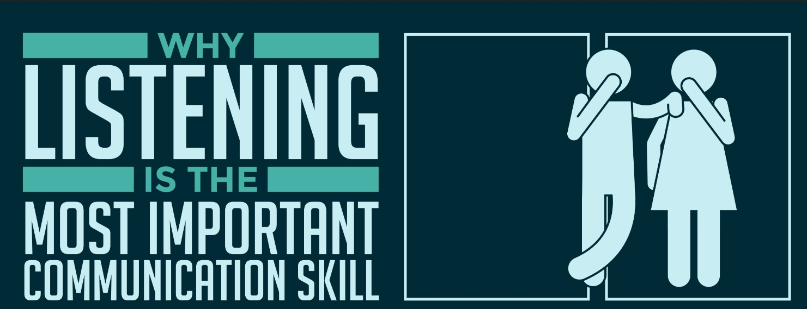
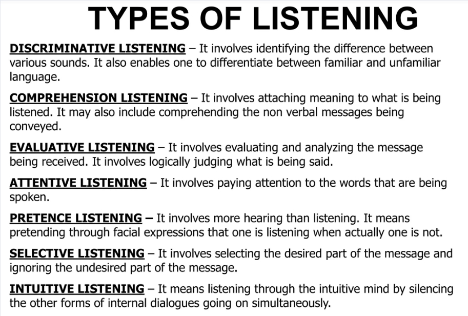
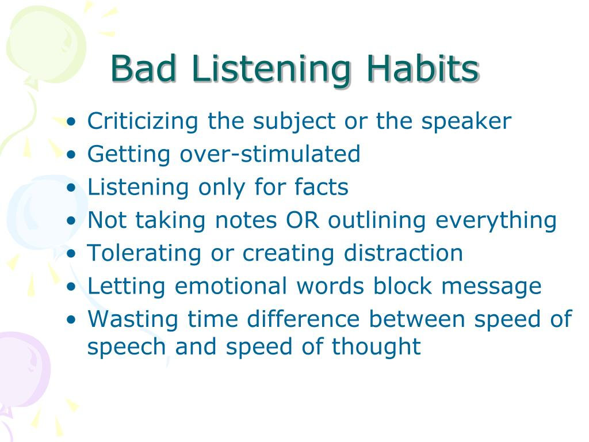
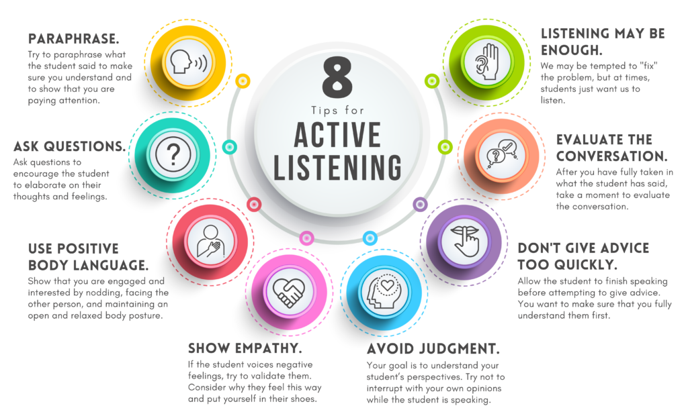
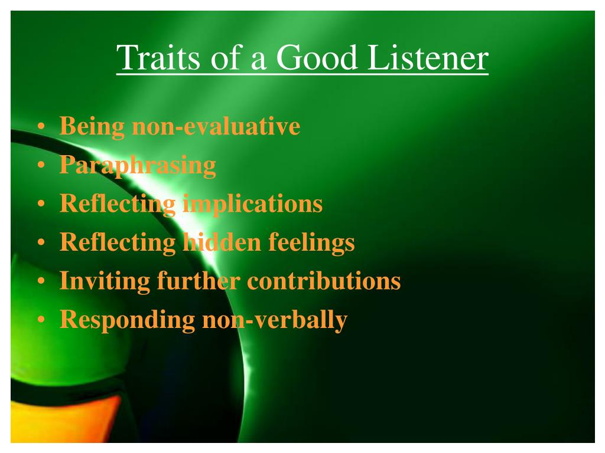
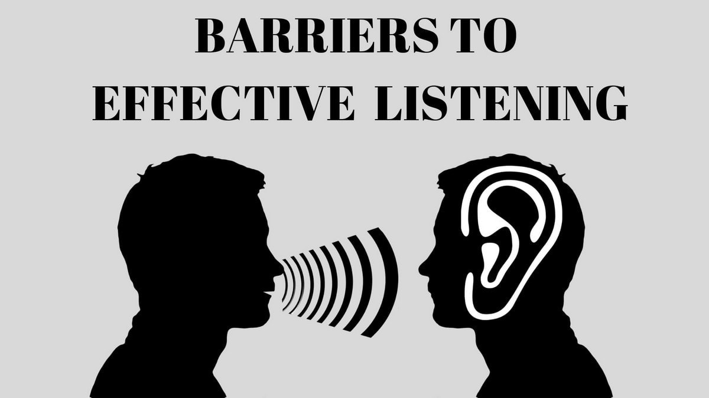

# LISTENING SKILLS

Here are both **brief** and **detailed** notes on the topics related to **Listening** in **Professional Communication** for BTech 1st year course:

### **1. Listening vs. Hearing**

#### Brief Notes:
- **Hearing**: Passive process of perceiving sound.
- **Listening**: Active process of understanding and interpreting sounds.

#### Detailed Notes:
- **Hearing** is the automatic, physiological act of perceiving sounds through the ear, which doesn’t necessarily involve comprehension.
- **Listening**, on the other hand, is a conscious effort where the listener pays attention, processes, and understands the speaker’s message.
- **Difference**: Hearing is involuntary and passive, while listening is active and requires engagement and effort.

### **2. Role of Effective Listening in Communication**

#### Brief Notes:
- Builds relationships, prevents misunderstandings, and enhances productivity in professional settings.

#### Detailed Notes:
- **Builds Trust and Rapport**: When you listen attentively, it shows respect and empathy, fostering stronger interpersonal relationships.
- **Prevents Misunderstandings**: Careful listening reduces the likelihood of miscommunication or errors, especially in professional environments.
- **Improves Decision-Making**: By understanding the full context of conversations, more informed and sound decisions can be made.
- **Increases Productivity**: Teams with effective listening skills work better together, ensuring that tasks are well-understood and completed efficiently.

### **3. Types of Listening**

#### Brief Notes:
- **Active Listening**: Fully engaged and attentive.
- **Passive Listening**: Listening without response or feedback.
- **Critical Listening**: Evaluating and analyzing information.
- **Empathetic Listening**: Understanding the speaker’s emotions.
- **Comprehensive Listening**: Focused on understanding and retaining information.

#### Detailed Notes:
- **Active Listening**: Requires full attention, with feedback provided through verbal and non-verbal cues. Encourages deeper engagement and understanding.
- **Passive Listening**: Involves hearing the message without providing feedback or engagement. Common in situations where the listener is not required to respond.
- **Critical Listening**: Used when assessing or evaluating the content of the message. Important in situations requiring judgment or decision-making.
- **Empathetic Listening**: Focuses on understanding the emotions or feelings behind the speaker’s message. Builds trust and connection.
- **Comprehensive Listening**: Focuses on understanding the details and information in order to retain it for future use (e.g., in lectures or instructions).

### **4. Poor Listening Habits**

#### Brief Notes:
- Interrupting, selective listening, distractions, prejudging, and daydreaming.

#### Detailed Notes:
- **Interrupting**: Cutting off the speaker before they finish their thought, which can lead to incomplete understanding and frustration.
- **Selective Listening**: Only paying attention to parts of the conversation that interest the listener, leading to missed or incomplete information.
- **Distractions**: Letting external or internal factors (like noise or personal stress) interfere with paying attention to the message.
- **Prejudging**: Forming conclusions before the speaker has finished, which leads to misunderstanding and biased interpretation.
- **Daydreaming**: Letting the mind wander, resulting in missing key points of the conversation.

### **5. Active Listening – An Effective Listening Skill**

#### Brief Notes:
- Requires full engagement, providing feedback, and demonstrating attentiveness.

#### Detailed Notes:
- **Concentration**: Focus completely on the speaker, avoid distractions, and refrain from interrupting.
- **Feedback**: Provide responses, either through verbal affirmations like “I see” or non-verbal cues like nodding to show understanding.
- **Clarification**: Ask questions or paraphrase the speaker’s points to ensure clarity and confirm understanding.
- **Non-verbal Cues**: Maintain eye contact, show attentive body language, and use facial expressions that reflect interest and understanding.

### **6. Traits of an Effective Listener**

#### Brief Notes:
- Attentiveness, patience, empathy, open-mindedness, and clarity-seeking.

#### Detailed Notes:
- **Attentiveness**: Paying close attention to both verbal and non-verbal cues.
- **Patience**: Allowing the speaker to finish their thoughts without rushing or interrupting.
- **Empathy**: Understanding and connecting with the speaker’s emotions, showing genuine concern.
- **Open-mindedness**: Listening without bias or judgment, remaining open to new ideas or perspectives.
- **Clarity-Seeking**: Asking questions or seeking further explanation to ensure full comprehension of the message.

### **7. Barriers to Effective Listening**

#### Brief Notes:
- Physical, psychological, emotional, and personal distractions; information overload; preconceived notions.

#### Detailed Notes:
- **Physical Barriers**: Environmental factors like noise, poor acoustics, or technical issues during communication.
- **Psychological Barriers**: Personal biases, assumptions, or prejudices that influence how a message is perceived.
- **Emotional Barriers**: Strong emotions such as stress, anger, or frustration that prevent clear understanding of the message.
- **Personal Distractions**: Internal distractions like fatigue, hunger, or preoccupation with personal issues.
- **Information Overload**: Receiving too much information at once can cause confusion and lead to selective attention.
- **Preconceived Notions**: Forming judgments or conclusions before fully listening to the message, leading to misunderstandings.

These notes should help you in your **Professional Communication** studies. Let me know if you need any more clarification!
